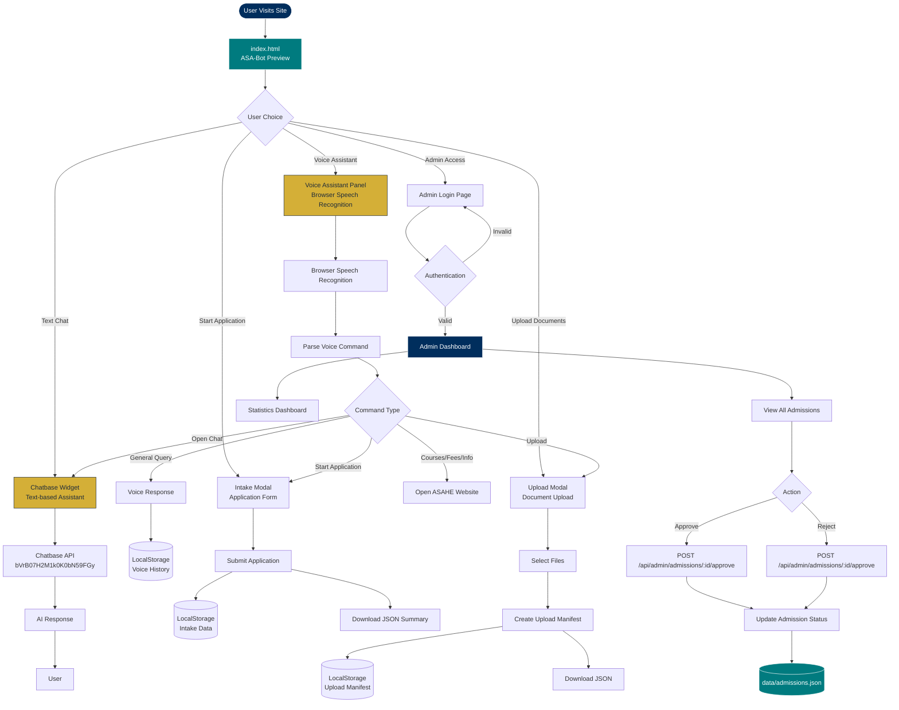
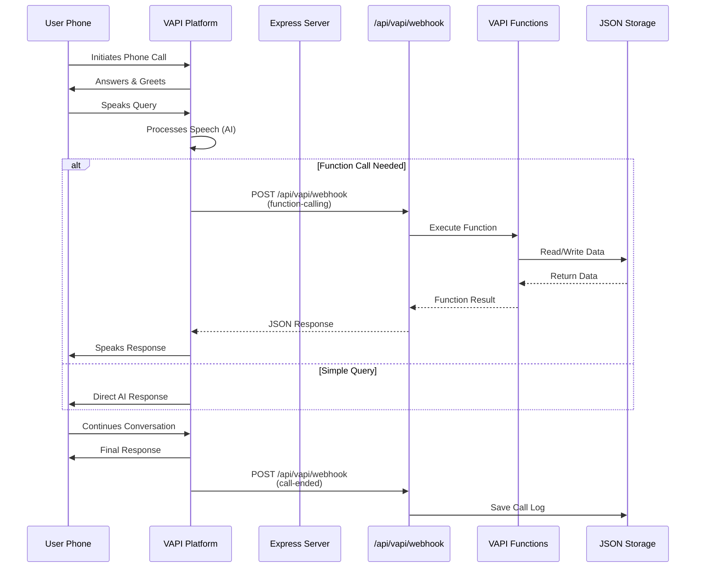
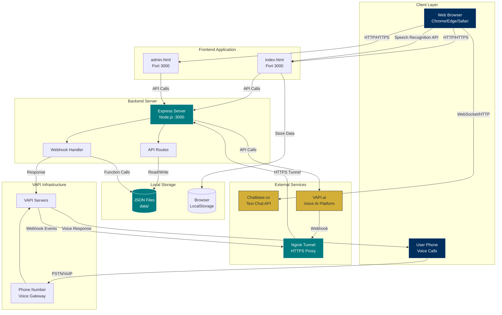
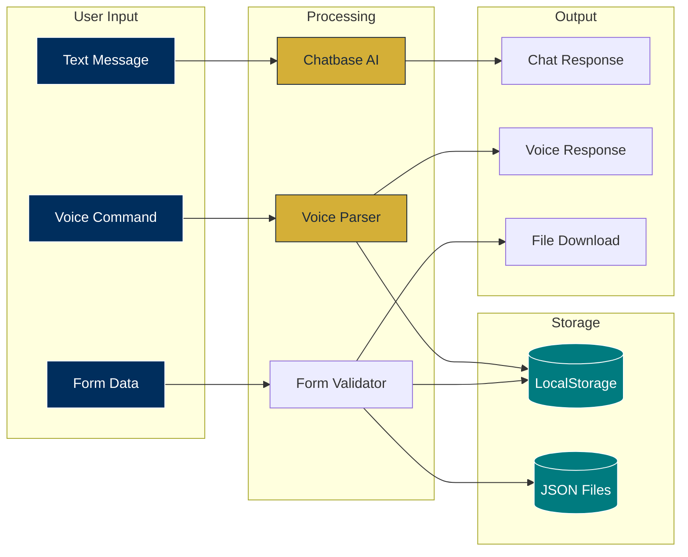
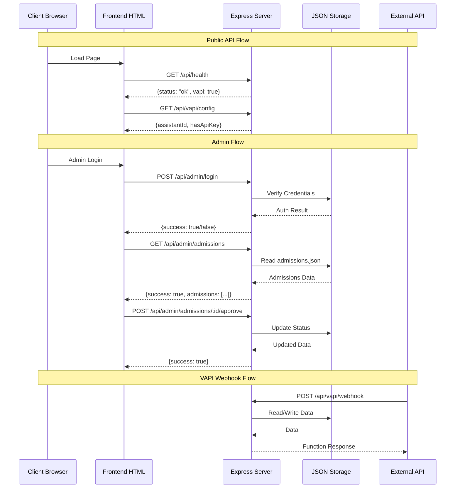

# ASA-Bot Architecture Diagrams

This document contains visual diagrams for the ASA-Bot system including flowcharts, sitemap, and network architecture.

## 1. System Flowchart - User Journey



## 2. VAPI Voice Call Flowchart



## 3. Site Map / Application Structure

```mermaid
graph TB
    Root[ASA-Bot System] --> Frontend[Frontend Layer]
    Root --> Backend[Backend Layer]
    Root --> External[External Services]
    Root --> Storage[Data Storage]
    
    Frontend --> Index[index.html<br/>Main Preview Page]
    Frontend --> Admin[admin.html<br/>Admin Panel]
    Frontend --> Assets[assets/<br/>Static Files]
    
    Index --> Features[Features]
    Features --> ChatbaseWidget[Chatbase Widget]
    Features --> VoicePanel[Voice Assistant]
    Features --> IntakeModal[Intake Form]
    Features --> UploadModal[Upload Modal]
    
    Admin --> Login[Login Form]
    Admin --> Dashboard[Admin Dashboard]
    Dashboard --> StatsView[Statistics View]
    Dashboard --> AdmissionsList[Admissions List]
    Dashboard --> Actions[Approve/Reject Actions]
    
    Backend --> API[Express Server<br/>Port 3000]
    API --> PublicAPI[Public APIs]
    API --> AdminAPI[Admin APIs]
    
    PublicAPI --> Health[GET /api/health]
    PublicAPI --> VAPIConfig[GET /api/vapi/config]
    PublicAPI --> VAPICall[POST /api/vapi/call]
    PublicAPI --> VAPIWebhook[POST /api/vapi/webhook]
    
    AdminAPI --> AdminLogin[POST /api/admin/login]
    AdminAPI --> GetAdmissions[GET /api/admin/admissions]
    AdminAPI --> ApproveAdmission[POST /api/admin/admissions/:id/approve]
    
    External --> Chatbase[Chatbase.co<br/>Text Chat Service]
    External --> VAPI[VAPI.ai<br/>Voice AI Service]
    External --> Ngrok[Ngrok<br/>Tunnel Service]
    External --> ASAHE[ASAHE.edu.au<br/>Main Website]
    
    Storage --> AdmissionsJSON[data/admissions.json]
    Storage --> AdminJSON[data/admin.json]
    Storage --> LocalStorage[Browser LocalStorage]
    
    LocalStorage --> VoiceHistory[asa.voice.history]
    LocalStorage --> IntakeData[asa.intakes]
    LocalStorage --> UploadData[asa.uploads]
    
    style Root fill:#002E5D,stroke:#fff,color:#fff
    style Frontend fill:#007B7F,stroke:#fff,color:#fff
    style Backend fill:#D4AF37,stroke:#1E2B3A,color:#1E2B3A
    style External fill:#007B7F,stroke:#fff,color:#fff
    style Storage fill:#007B7F,stroke:#fff,color:#fff
```



## 4. Network Architecture Diagram



## 5. Data Flow Diagram



## 6. API Request Flow



## 7. Component Interaction Diagram

```mermaid
graph TB
    subgraph "Frontend Components"
        Index[index.html]
        Admin[admin.html]
        ChatbaseWidget[Chatbase Widget]
        VoicePanel[Voice Panel]
        IntakeModal[Intake Modal]
        UploadModal[Upload Modal]
    end
    
    subgraph "Backend Services"
        ExpressServer[Express Server]
        HealthEndpoint[/api/health]
        VAPIConfig[/api/vapi/config]
        VAPIWebhook[/api/vapi/webhook]
        AdminLogin[/api/admin/login]
        AdminAdmissions[/api/admin/admissions]
    end
    
    subgraph "External APIs"
        ChatbaseAPI[Chatbase API]
        VAPIService[VAPI Service]
    end
    
    subgraph "Data Layer"
        AdmissionsFile[admissions.json]
        AdminFile[admin.json]
        BrowserStorage[LocalStorage]
    end
    
    Index --> ChatbaseWidget
    Index --> VoicePanel
    Index --> IntakeModal
    Index --> UploadModal
    
    ChatbaseWidget <--> ChatbaseAPI
    VoicePanel --> BrowserStorage
    IntakeModal --> BrowserStorage
    UploadModal --> BrowserStorage
    
    Index --> HealthEndpoint
    Index --> VAPIConfig
    Admin --> AdminLogin
    Admin --> AdminAdmissions
    
    HealthEndpoint --> ExpressServer
    VAPIConfig --> ExpressServer
    VAPIWebhook --> ExpressServer
    AdminLogin --> ExpressServer
    AdminAdmissions --> ExpressServer
    
    ExpressServer --> AdmissionsFile
    ExpressServer --> AdminFile
    
    VAPIService --> VAPIWebhook
    
    style Index fill:#002E5D,stroke:#fff,color:#fff
    style Admin fill:#002E5D,stroke:#fff,color:#fff
    style ExpressServer fill:#007B7F,stroke:#fff,color:#fff
    style ChatbaseAPI fill:#D4AF37,stroke:#1E2B3A,color:#1E2B3A
    style VAPIService fill:#D4AF37,stroke:#1E2B3A,color:#1E2B3A
```

## How to View These Diagrams

1. **VS Code**: Install the "Markdown Preview Mermaid Support" extension
2. **GitHub**: These diagrams will render automatically in GitHub markdown
3. **Online**: Use [Mermaid Live Editor](https://mermaid.live/) to view/edit
4. **Documentation**: Many markdown viewers support Mermaid diagrams

## Diagram Legend

- **Navy Blue (#002E5D)**: User-facing components, entry points
- **Teal (#007B7F)**: Backend services, data storage
- **Gold (#D4AF37)**: External services, APIs


